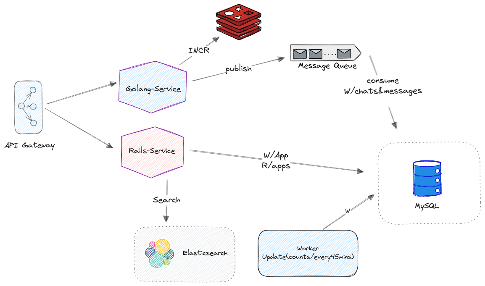
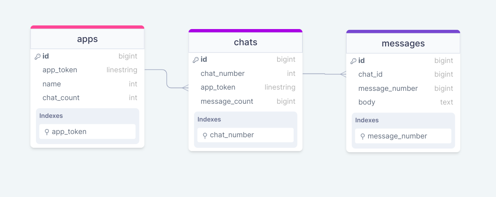

# Chat API [(API Documentation 🚀)](https://documenter.getpostman.com/view/19528493/2s9YkocLjG)
Chat API for **Instabug** Backend Engineer Challenge.
### Stack
Golang, Gin, Rails, Redis, RabbitMQ, ElasticSearch, Docker

## API

### Running The API 

Clone the project

```bash
git clone https://github.com/aminyasser/chat-api.git
cd chat-api
```
You must have docker and docker-compose installed.
The application is all dockerize, you just need to type the following command to run it.

```bash
 docker-compose  up --build 
```

### API Documentation

You can check out the postman documentation from [Here 🚀](https://documenter.getpostman.com/view/19528493/2s9YkocLjG)
Or import this [Postman Collection](https://github.com/aminyasser/chat-api/blob/main/readme-content/Chat-API.postman_collection.json) to try locally.

All requests in the api under port 8000, Example of creating app:
```http
POST    http://0.0.0.0:8000/api/v1/apps
```

## System Architecture
### Diagram


### Service Structure 
I was asked to do specific parts of the application with Golang to handle race conditions, so I made a Golang service for creating chats and messages and running workers that update the chat_count and message_count in apps and chats tables.

The rails service contains creating an app and getting the app endpoints, also containing the search endpoint.

Finally, the apigateway service is a simple go script forwarding the requests to the right service using reverse proxy. 

### Redis and Race Condition problem
I used Redis INCR to handle the problem of chat_number and message_number, in the problem statement "**Numbering of chats in
each application starts from 1 and no 2 chats in the same application may have the same number**" so I used Redis INCR by the ``token`` for chat_count and ``chat_number:token`` for message_count.

So because of Redis single-threaded nature, the race condition is avoided here.

There is another way to do that by mutex.lock, but I preferred Redis for doing it. 


### Message queueing (RabbitMQ)
I used rabbitMQ to handle the amount of requests and avoid running the critical part of creating chats and messages into the database directly.

when the app starts, the queue is declared and the consumer is ready to fetch the publishing messages.


### Elastic Search
using elastic search for fast searching queries on messages, I mapped the body, and chat_id.

basic searching with ``body`` of the message using standard analyzer and filter with chat_id.


## Database
### Diagram


### Indexes
I used indexes in the frequent queries, I added ``app_token`` index on the apps table. to make getting an app query faster, I used it to check if the app exits in the database.

I add also ``chat_number`` and ``message_number`` in each chat and messages table, with them I search by foreign keys like app_token and chat_id, so the search query will be fast.


